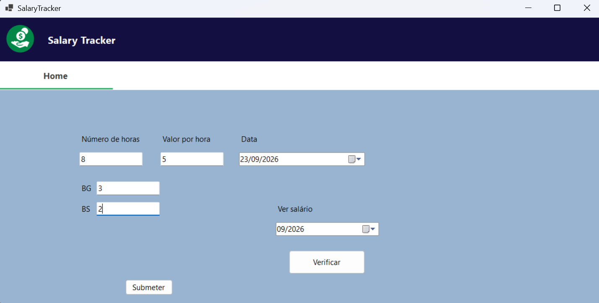

# Salary Tracker

Aplicação de desktop para estafetas calcularem e registarem o que recebem
por dia de trabalho.

O utilizador introduz as horas trabalhadas, o valor por hora e o número de
entregas feitas (BG e BS), e a aplicação calcula e guarda o total desse dia.
Para saber quanto vai receber num mês, basta selecionar o mês e a aplicação
soma todos os registos desse período.

As entregas são pagas à unidade: 0,40 € por entrega BG e 0,25 € por entrega BS.



## Funcionalidades
- Registo diário de horas, valor/hora e entregas
- Cálculo automático do total do dia
- Guarda os registos numa base de dados SQLite
- Impede dois registos na mesma data
- Total a receber por mês

## Tecnologias
- C# / .NET 8
- Windows Forms
- SQLite

## Como correr
**Requisitos:** Windows e [.NET 8 SDK](https://dotnet.microsoft.com/download)

```bash
git clone https://github.com/brunofmsilva11/SalaryTracker.git
cd SalaryTracker/SalaryTracker
dotnet run
```

A base de dados (`dados_trabalho.db`) é criada automaticamente na primeira execução.

## Por fazer
- Histórico de registos
- Editar e remover registos